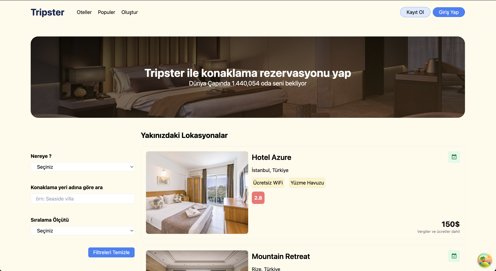
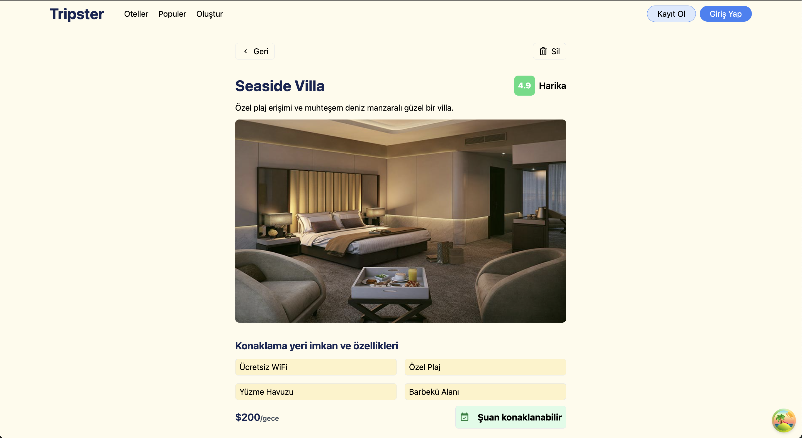
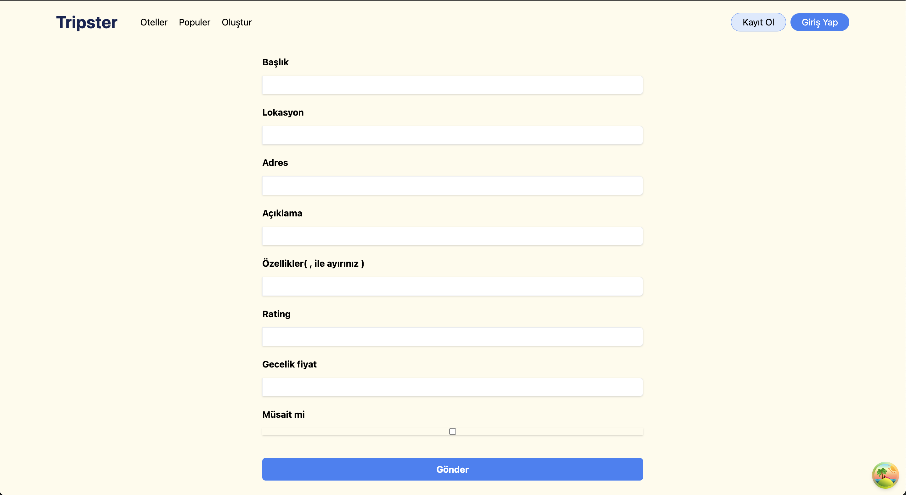

# Hotels App (TanStack Query)

## Project Overview

Hotels App is a full-stack hotel management application built with React and Node.js, utilizing TanStack Query for efficient API data fetching, caching, and synchronization with the backend. The backend server, developed with Node.js, uses data.json to simulate database operations for hotel data management. The application provides users with the ability to browse hotels, view hotel details, and create new hotel entries with dynamic filtering and sorting capabilities.

## Video gif


## Main Page



## Detail Page



## Create Page



## Features

- Home Page: Lists all available hotels with options for filtering and sorting.
- Hotel Detail Page: Displays detailed information for a selected hotel.
- Create Hotel Page: Allows users to add new hotels to the database.
- Filtering & Sorting: Users can filter hotels by location, accommodation type, price, and rating (ascending/descending).
- API Management: Utilizes TanStack Query for seamless API data handling, including automatic caching and state manag

## Technologies Used

- Frontend: React, TypeScript, TanStack Query, Formik for form handling
- Backend: Node.js (database simulated with data.json)
- Styling: Tailwind CSS
- HTTP Requests: Axios
- UI Libraries: React Icons, React Toastify for notifications

## Setup Instructions

To run this project on your local machine, follow these steps:

1. Clone the repository:

   ```
   git clone https://github.com/ozerbaykal/hotels_app_tanstcak_query.git
   ```

2. Install dependencies:

   ```
   npm install
   ```

3. Start the Backend Server

```
npm start
```

4. Start the application:
   ```
   npm run dev
   ```
   This will start the frontend development server, and you can access the application at http://localhost:5173

## Libraries Used

- @tanstack/react-query and @tanstack/react-query-devtools: - Handles API data management, caching, and dev tools.
- axios: Manages HTTP requests.
- formik: Facilitates form handling in the Create Hotel page.
- react-router-dom: Manages routing between pages.
- react-toastify: Provides toast notifications for user feedback.
- react-icons: Supplies icons for UI enhancement.

<h2>Contributing</h2>

Contributions are welcome! Please open an issue first to discuss what you would like to change.

- 1.Fork the project
- 2.Create your feature branch (git checkout -b feature/NewFeature)
- 3.Commit your changes (git commit -m 'Add new feature')
- 4.Push to the branch (git push origin feature/NewFeature)
- 5.Open a Pull Request

<h2>Contact</h2>

Özer BAYKAL mail : baykalozer87@gmail.com

Project Link: https://github.com/ozerbaykal/hotels_app_tanstcak_query
